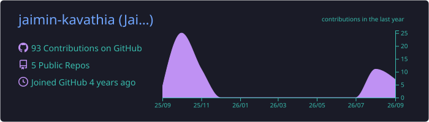
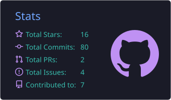
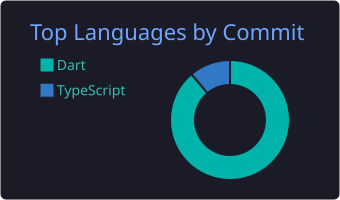

  

  

  
  
  
  

  
  

<h2>🧑‍💻 About Me</h2>

I'm a <b>Flutter Developer with 4+ years of experience</b> building production-ready, scalable apps for <b>Android, iOS, Web, and Desktop</b> from a single codebase. I care about clean architecture, smooth UI, and code that other developers enjoy working with.

<pre><code>class JaiminKavathia {
  final String role = 'Flutter Developer';
  final int experienceYears = 4;
  final List&lt;String&gt; platforms = ['Android', 'iOS', 'Web', 'Desktop'];
  final List&lt;String&gt; stateManagement = ['BLoC', 'Cubit', 'Provider'];
  final List&lt;String&gt; backend = ['Firebase', 'REST APIs', 'AWS Amplify'];
  final String architecture = 'Clean Architecture + SOLID';
  final String currentlyLearning = 'TODO: e.g. Riverpod / Flutter + AI';
  final String funFact = 'TODO: add something fun about you';
}</code></pre>

<ul>
  <li>🔭 Currently working on <b>TODO: your current project or role</b></li>
  <li>🌱 Exploring <b>TODO: what you're learning</b></li>
  <li>🤝 Open to <b>freelance projects, collaborations, and full-time Flutter roles</b></li>
  <li>💬 Ask me about <b>Flutter, Dart, BLoC, Firebase, app architecture</b></li>
  <li>👨‍💻 All my projects → <a href="https://jaimin-kavathia.github.io/">jaimin-kavathia.github.io</a></li>
</ul>

<h2>🛠️ Tech Stack</h2>

  

<b>📦 Packages &amp; Tools I use regularly</b>

 
<table>
  <tr><th>Category</th><th>Tools</th></tr>
  <tr><td><b>State Management</b></td><td>flutter_bloc, Cubit, Provider</td></tr>
  <tr><td><b>Networking</b></td><td>Dio, http, Retrofit</td></tr>
  <tr><td><b>Backend / BaaS</b></td><td>Firebase (Auth, Firestore, FCM, Crashlytics, Analytics), AWS Amplify</td></tr>
  <tr><td><b>Local Storage</b></td><td>Hive, SharedPreferences, SQLite</td></tr>
  <tr><td><b>Architecture</b></td><td>Clean Architecture, Repository Pattern, Dependency Injection (get_it)</td></tr>
  <tr><td><b>Testing</b></td><td>Unit tests, Widget tests, bloc_test, mocktail</td></tr>
  <tr><td><b>CI/CD</b></td><td>GitHub Actions, Codemagic, Fastlane</td></tr>
  <tr><td><b>Design</b></td><td>Figma, Photoshop</td></tr>
</table>

<h2>🚀 Featured Projects</h2>

<!-- Replace the placeholders below with your best 4 projects -->
<table>
  <tr><th>Project</th><th>Description</th><th>Tech</th></tr>
  <tr><td><a href="https://github.com/jaimin-kavathia/REPO_NAME"><b>Project One</b></a></td><td>One line about what it does and who it's for</td><td>Flutter · BLoC · Firebase</td></tr>
  <tr><td><a href="https://github.com/jaimin-kavathia/REPO_NAME"><b>Project Two</b></a></td><td>One line about what it does and who it's for</td><td>Flutter · REST API · Hive</td></tr>
  <tr><td><a href="https://github.com/jaimin-kavathia/REPO_NAME"><b>Project Three</b></a></td><td>One line about what it does and who it's for</td><td>Flutter Web · AWS Amplify</td></tr>
  <tr><td><a href="https://github.com/jaimin-kavathia/REPO_NAME"><b>Project Four</b></a></td><td>One line about what it does and who it's for</td><td>Flutter Desktop · TensorFlow Lite</td></tr>
</table>

<a href="https://jaimin-kavathia.github.io/"><b>➡️ See all projects on my portfolio</b></a>

<h2>✍️ Latest Blog Posts</h2>

<ul>
<!-- BLOG-POST-LIST:START --><li>✍️ <a href="https://medium.com/@jaiminkavathia30/introducing-smart-permission-runtime-permissions-made-effortless-in-flutter-30f4785a588f?source=rss-56f5ea27741b------2">Introducing smart_permission — Runtime Permissions Made Effortless in Flutter</a></li>
<li>✍️ <a href="https://medium.com/@jaiminkavathia30/wait-theres-a-blocselector-my-flutter-bloc-awakening-4b66edbb84d4?source=rss-56f5ea27741b------2">“Wait… There’s a BlocSelector?!” — My Flutter Bloc Awakening</a></li>
<li>✍️ <a href="https://medium.com/@jaiminkavathia30/flutters-missing-piece-effortless-media-picking-with-limited-access-support-9a1a24404667?source=rss-56f5ea27741b------2">Flutter’s Missing Piece: Effortless Media Picking with Limited Access Support</a></li>
<!-- BLOG-POST-LIST:END -->
</ul>

<a href="https://medium.com/@jaiminkavathia30">📚 Read more on Medium →</a>

<h2>📊 GitHub Stats</h2>

  

  
  

  

<h2>🐍 Contribution Snake</h2>

  <picture>
    <source media="(prefers-color-scheme: dark)" srcset="https://raw.githubusercontent.com/jaimin-kavathia/jaimin-kavathia/output/github-snake-dark.svg" />
    <source media="(prefers-color-scheme: light)" srcset="https://raw.githubusercontent.com/jaimin-kavathia/jaimin-kavathia/output/github-snake.svg" />
    
  </picture>

<h2>🤝 Let's Work Together</h2>

I'm always happy to talk about <b>Flutter projects, freelance work, or full-time opportunities</b>. 
📫 Reach me at <a href="mailto:jaiminkavathia30@gmail.com"><b>jaiminkavathia30@gmail.com</b></a> or connect on <a href="https://www.linkedin.com/in/jaimin-kavathia-flutter-developer"><b>LinkedIn</b></a>.

  

